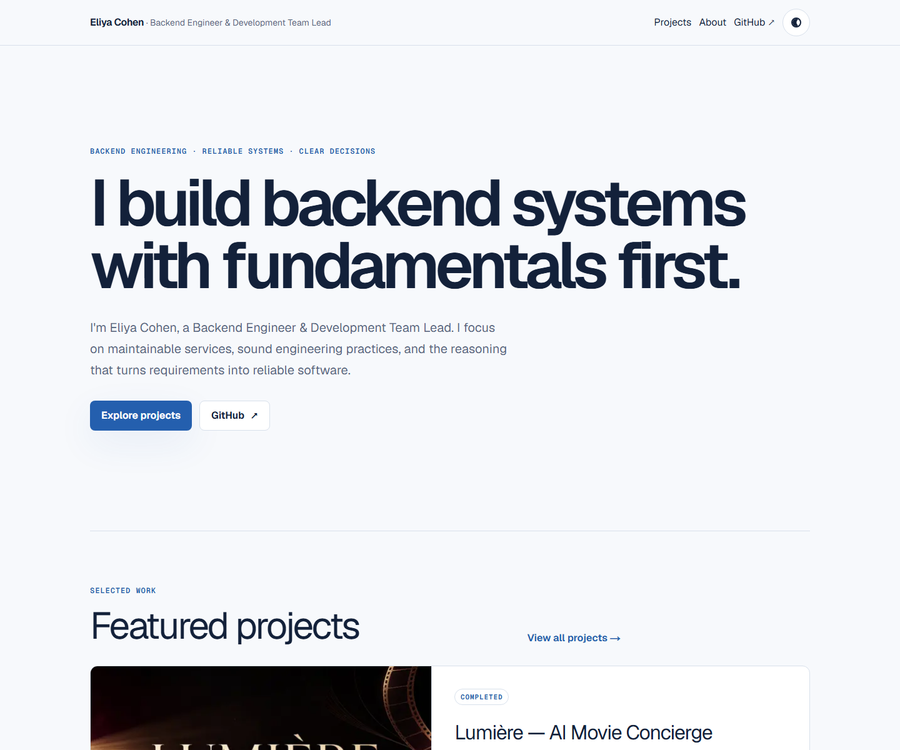

# Eliya Cohen — Portfolio

[](https://github.com/Eliya25/eliya-portfolio/actions/workflows/ci.yml)

Professional portfolio for Eliya Cohen, a Backend Engineer & Development Team Lead. It presents deployed projects through the problems they solve, their architecture, testing strategy, and engineering trade-offs.

- [Live Portfolio](https://eliya-portfolio.vercel.app)
- [Featured Case Study: Lumière](https://eliya-portfolio.vercel.app/projects/lumiere)
- [GitHub Profile](https://github.com/Eliya25)



## Overview

The portfolio uses the Next.js App Router and primarily renders with React Server Components. Engineering case studies are authored in MDX, while Zod validates project frontmatter during tests and production builds. Project pages, static parameters, metadata, and sitemap entries are all generated from the same content source. GitHub Actions validates each change, and Vercel publishes the site.

## Key Features

- Home, Projects, About, and project detail pages
- MDX engineering case studies with Zod-validated metadata
- Static project generation from a shared content source
- Visual project cards with optional cover, demo, and repository links
- Case study table of contents with stable, unique heading anchors
- Light and dark themes
- Responsive and accessible layouts
- SEO metadata, Open Graph image, sitemap, and robots configuration
- Unit and end-to-end testing
- GitHub Actions CI validation and Vercel deployment

## Featured Project

### Lumière — AI Movie Concierge

Lumière turns natural-language movie preferences into structured recommendations, then enriches them with catalogue data while isolating external-provider failures.

- [Read the Case Study](https://eliya-portfolio.vercel.app/projects/lumiere)
- [Open the Live Demo](https://lumiere-ai-movie-concierge.vercel.app)
- [View the Lumière Repository](https://github.com/Eliya25/lumiere-ai-movie-concierge)

## Technology Stack

- Next.js App Router
- React
- TypeScript
- Tailwind CSS
- MDX
- Zod
- Vitest
- Playwright with axe-core
- GitHub Actions
- Vercel

## Architecture

- The App Router defines pages, static project routes, and route-specific metadata.
- Server Components are the default. Client Components are limited to browser-state requirements: the theme toggle and the Next.js error boundary.
- `src/content/projects/*.mdx` is the source of truth for project content.
- A server-only loader reads each MDX file and validates its frontmatter with Zod.
- The project index, static parameters, project metadata, and sitemap are derived from the same validated project model.
- A safe MDX policy rejects imports, exports, JavaScript expressions, and components outside a small allowlist.

## Repository Structure

```text
.github/workflows/      GitHub Actions CI
docs/                   Quality documentation and README assets
public/                 Static project media
src/app/                App Router pages, metadata, sitemap, and robots
src/components/         Layout, theme, and project components
src/content/projects/   MDX project case studies
src/lib/                Shared profile, metadata, and site configuration
src/lib/content/        Project schema, loader, anchors, and MDX safety
tests/e2e/              Playwright journeys and quality checks
```

## Getting Started

The repository declares pnpm `11.24.0` as its package manager.

```bash
git clone https://github.com/Eliya25/eliya-portfolio.git
cd eliya-portfolio
pnpm install
pnpm dev
```

Open <http://localhost:3000>. No environment variable is required for local development; the application has a documented default site URL. To verify an optimized build:

```bash
pnpm build
pnpm start
```

## Available Scripts

| Command             | Purpose                                       |
| ------------------- | --------------------------------------------- |
| `pnpm dev`          | Start the local Next.js development server    |
| `pnpm build`        | Create an optimized production build          |
| `pnpm start`        | Serve the production build                    |
| `pnpm lint`         | Run ESLint                                    |
| `pnpm format`       | Format supported files with Prettier          |
| `pnpm format:check` | Check formatting without rewriting files      |
| `pnpm type-check`   | Run TypeScript checking without emitting code |
| `pnpm test`         | Run the Vitest suite                          |
| `pnpm e2e`          | Run Playwright end-to-end tests               |

Install Chromium once before running E2E locally:

```bash
pnpm exec playwright install chromium
```

## Adding a Project

1. Create `src/content/projects/<slug>.mdx`.
2. Add frontmatter that matches the [project schema](src/lib/content/project-schema.ts).
3. Keep the frontmatter `slug` identical to the filename.
4. Add an optional cover or gallery only through the image structure defined by the schema, with local media under `public/images/projects/<slug>/`.
5. Write the engineering case study in the MDX body using Markdown and approved project components.
6. Run `pnpm test` and `pnpm build`.

The Projects index, project route, static parameters, metadata, and sitemap update automatically. Invalid metadata, an empty body, unsafe MDX, or a filename/slug mismatch fails validation.

## Testing and Quality

The quality gates cover:

- ESLint, Prettier, and strict TypeScript checking
- Vitest tests for schemas, content loading, safe MDX, anchor IDs, and site URLs
- Next.js production builds
- Playwright journeys and internal-link validation
- axe WCAG A/AA accessibility checks
- Keyboard focus order and horizontal overflow
- Responsive coverage at 320px, 375px, 768px, and 1440px

The current repository state passes 21 unit tests and 7 Playwright tests. Counts may change as the project evolves. See the [quality report](docs/quality-report.md) for the latest verified audit, including Lighthouse lab measurements.

## CI and Deployment

The [CI workflow](.github/workflows/ci.yml) runs dependency installation, linting, formatting checks, TypeScript checks, unit tests, a production build, Chromium installation, and deterministic Playwright E2E tests.

Vercel is connected to GitHub and publishes the portfolio independently of the CI workflow. `NEXT_PUBLIC_SITE_URL` supplies the production origin used for absolute canonical, Open Graph, sitemap, and robots URLs. GitHub Actions validates the repository; it does not promote or approve production releases.

The portfolio is complete and can grow with additional source-backed case studies over time.
